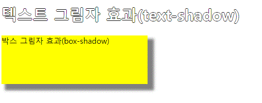
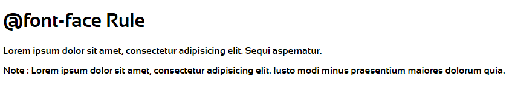
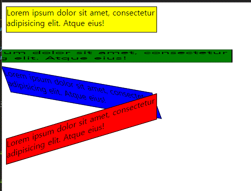

# css

## 1. CSS

ㄱ. Cascading Style Sheets 약어<br>
ㄴ. html 요소가 표시되는 방법을 설명<br>
ㄷ. html 문서의 스타일 지정하는데 사용<br>
ㄹ. 많은 작업(유지, 보수, 지정) 절약<br>
ㅁ. 여러 웹 페이지의 스타일을 일괄적으로 관리할 수 있다(장점)<br>
ㅂ. 외부 스타일 시트(.css) 사용 가능<br>
ㅅ. 다양한 장치(기기) 및 화면 크기에 대한 출력의 디자인, 레이아웃 및 변경 스타일 정의 처리<br>
ㅇ. html 요소가 화면, 종이 또는 기타 미디어에 표시되는 방식 지정<br>
<br>

## 2. CSS 구문(형식)

스타일 적용할 대상 세미콜론(;)<br>
selector { 속성:속성값; 속성:속성값; 속성:속성값;...}<br>
&nbsp; &nbsp; &nbsp; ㄴ 선택자<br>
<br>

## 3. CSS 적용하는 방법<br>

<b>ㄱ. 내부(internal) CSS 적용 방법 - 해당 문서(웹페이지)만 스타일 적용 - head 태그 안에 style 태그</b><br>

```html
<head>
  <style>
    selector {
      속성: 속성값;
      ...;
    }
  </style>
</head>
```

<br>

<b>ㄴ. 인라인(inline) CSS 적용 방법 - 해당 요소에만 스타일 적용</b><br>
&nbsp; &nbsp; &nbsp; &nbsp; 시작 태그 안에 style 속성으로 스타일 적용<br>

```html
<p style="스타일적용"></p>
<p style="border: 1px solid gray;"></p>
```

<br>

<b>ㄷ. 외부(External) CSS 적용 방법 - 여러 문서(웹페이지)에 스타일 적용</b><br>
&nbsp; &nbsp; &nbsp; &nbsp; 외부 스타일 적용할 파일 => style.css<br>
<br>
&nbsp; &nbsp; 외부 css 파일 모양)

```css
@charset "UTF-8";

body {
  background-color: lightblue;
}
```

<br>
&nbsp; &nbsp; 선언 형식)

```html
<link rel="stylesheet" href="css파일명.css" />
```

<br>

## 4. CSS 선택자(selector)

1. 태그명
2. #아이디명
3. .클래스명
4. 그룹화 => 태그명, .아이디명..<br>
   &nbsp; &nbsp; &nbsp; &nbsp; &nbsp; &nbsp; &nbsp; &nbsp; &nbsp; &nbsp; &nbsp; &nbsp; &nbsp; &nbsp; &nbsp; :

<br>

## 5. CSS 적용 우선순위(정리중..)

- 맨 위에 있는 css 먼저 적용한 후 마지막에 설정한 값으로 적용이 되어진다.
- internal CSS 적용 방법보다 inline CSS 적용 방법이 우선순위가 높다.
- 태그명.클래스명 > 클래스명 > 태그명
- 태그명#아이디명 > #아이디명 > 태그명

<br>

## 6. CSS 색상 지정

1. 표준색상명(140개)으로 나타냄
2. RGB(0 ~ 255, 0 ~ 255, 0 ~ 255) - red/green/blue 색의 3원소 값을 주어서 나타냄
3. #16진수값 - HEX == 16진수
4. RGBA(alpha 투명도 0.0~1.0)
5. HSL - hue(색조) / saturation(채도) / lightness(밝기, 명도)
   <ul>
   <li>색조 : 0~360 / 채도 : 0~100% / 밝기 : 0(검정)~100%(흰색)</li>
   <li> 0(빨강) / 120(녹색) / 240(파랑)</li>
   </ul>
6. HSLA(alpha 투명도 0.0~1.0)

<br>

<b>[코드 예시]</b>

```html
<style>
  p {
    /* 1. 표준 색상명(140개) */
    background-color: tomato;

    /* 2. RGB(0~255, 0~255, 0~255) */
    /* color: white; */
    /* color : rbb(255, 255, 255) */
    color: rgb(255, 255, 255);

    /* 3. #16진수값 */
    /* color: #ffffff; */
    color: #fff;

    /* 4. RGBA */
    color: rgb(255, 255, 255, 0.5);

    /* 5. HSL - hue(색조) / saturation(채도) / lightness(밝기, 명도) */
    background-color: hsl(0, 100%, 50%);
  }
</style>
```

```html
<body>
  /* inline css 적용 방식 */
  <p style="background-color: hsla(9, 100%, 64%, 0.5)">
    Lorem ipsum dolor sit amet.
  </p>
</body>
```

<br>

## 7. CSS 배경과 배경색, 배경이미지

1. 배경 배경색 : background-color
2. 배경 이미지 : background-image
3. 배경 반복 : background-repeat
4. 배경 위치 : background-position
5. 배경 약식 속성 : background(color image repeat attachment position 순서대로..)

<b>[배경색 코드 예시]</b>

```html
<style>
  /* color를 주는 속성값과 거의 동일함 */

  h3 {
    background-color: yellow;
  }

  /* 블럭모드 = width 100% 다 잡힘 */
  div {
    border: 1px solid gray;
    width: 200px;
    padding: 10px;

    /* 투명도 0(투명) ~ 1(불투명) */
    background-color: rgba(0, 255, 0, 0.1);
  }

  div.first {
    /* opacity : 투명도만 주는 속성 / opacity 속성으로 투명도를 설정하면 자식(하위) 요소도 동일한 투명도를 상속(적용)한다 */
    opacity: 0.5;
  }
</style>

<body>
  <div class="bg_test">
    <div class="first">Lorem ipsum dolor.</div>
    <div class="second">Perspiciatis quas quidem!</div>
    <div class="third">Eius odit quod.</div>
    <!-- inline 방식이 더 우선이라 적용되어짐 -->
    <div style="background-color: rgba(0,255,0,0.3);">
      Inventore amet expedita!
    </div>
    <div>Neque quaerat illo.</div>
  </div>
</body>
```

<b>[적용 결과]</b>


<br>

<b>[배경 이미지, 반복, 위치 코드 예시]</b>

```html
<style>
  body {
    /* background-color: orange; */
    /* 이미지는 전체 요소(body)를 덮도록 자동으로 가로/세로 반복하고 있다. */
    /* 배경색 : 주황 => 배경색은 적용되어져 있고, 그 위에 이미지를 덮고 있다. */
    /* (주의) 텍스트의 색상에 방해되지 않도록 배경 이미지를 사용한다. */
    background-image: url("https://item.kakaocdn.net/do/c620e34ce78db64b44ff1e422a35e2787154249a3890514a43687a85e6b6cc82");

    /* background-repeat : 배경 반복을 주는 속성 */ /* ex02의 3번 */
    /* background-repeat: repeat;*/ /* 안주면 기본값 */
    /* background-repeat: repeat-x; */ /* y축을 반복 */
    /* background-repeat: repeat-y; */ /* x축을 반복 */
    background-repeat: no-repeat; /* 반복 안하겠다. */

    /* 스크롤을 내리면 배경도 같이 올라가짐 */ /* ex02의 4번 */
    /* background-attachment: scroll; */ /* 기본값 */
    background-attachment: fixed; /* 스크롤 내려도 배경 고정됨 */

    /* 우측 상단에 위치하게 됨 */
    /* %와 px을 줘도 됨 */
    background-position: right top;
  }

  #top {
    /* css 테두리 약식 */
    /* border: 1px solid gray; */
    border-width: 1px;
    border-style: solid;
    border-color: gray;

    width: 25px;
    height: 25px;

    /* ***** 위치를 나타내는 속성 left, top, right, bottom **** */
    position: fixed; /* 고정 시킬거다 */
    right: 5px; /* 우측으로 5px 위치에 */
    bottom: 5px; /* 아래쪽 5px 위치에 */
  }

  #top:hover {
    background-color: black;
    color: yellow;
    font-weight: bold;
    cursor: pointer; /* 커서 모양을 손가락 모양으로.. */
  }
</style>

<body>
  <div id="top" onclick="top_click();">Top</div>
  <h3>css 배경 이미지</h3>
  Lorem ipsum dolor sit amet, consectetur adipisicing elit. Vitae aperiam
  ratione aspernatur iste maxime rerum illum sint optio labore iusto ut et.
  Ratione laboriosam enim eos nostrum minima rerum asperiores.
  <p>.</p>
  <p>.</p>
  <p>.</p>
  <p>.</p>
  <p>.</p>

  <script>
    function top_click() {
      // alert("이벤트 발생 확인");
      // 아래 2가지 코딩은 동일한 코딩(맨위로 올리겠다.)
      // 브라우저 마다 적용되는 방식이 달라서 중복 코딩을 한다.
      document.body.scrollTop = 0;
      document.documentElement.scrollTop = 0; // 크롬에서 적용되는 함수
    }
  </script>
</body>
```

<b>[적용 결과]</b>


<br>

## 7-2. 여러 배경 이미지 추가(다중 배경 설정)

[속성들]

1. background-size
2. background-origin
3. background-clip

<b>[코드 예시]</b>

```html
<style>
  div#demo {
    background-image: url("../images/img_flwr.gif"), url("../images/paper.gif");
    background-repeat: no-repeat, repeat;
    background-position: right bottom, left top;

    /* 약식 */
    /* background: url('../images/img_flwr.gif') no-repeat right bottom; */

    background: url("../images/img_flwr.gif") no-repeat right bottom, url("../images/paper.gif")
        repeat left top;
  }
</style>

<body>
  <!-- #demo>h1>lorem3^p*2>lorem -->
  <div id="demo">
    <h1>Lorem ipsum dolor.</h1>
    <p>
      Lorem ipsum dolor sit amet, consectetur adipisicing elit. Optio
      exercitationem facilis ad odit iste expedita unde enim laborum. Odio
      distinctio culpa reiciendis autem natus soluta praesentium dolor obcaecati
      temporibus et!
    </p>
    <p>
      Nesciunt error enim iste officiis modi ad repudiandae porro. Mollitia
      reprehenderit omnis adipisci distinctio sapiente in aliquid vel fugiat
      laborum sunt totam laboriosam sed quod cupiditate quibusdam non temporibus
      dicta!
    </p>
  </div>
</body>
```

<b>[적용 결과]</b>


<br>

## 7-3. background-size의 속성 값

- contain : 가능한 크게 배경 이미지를 확대
- cover : 콘텐츠 영역이 완전히 배경 이미지에 포함되도록 처리

<b>[코드 예시]</b>

```html
<style>
  div {
    width: 150px;
    height: 120px;
    border: 1px solid black;

    background: url("../images/img_flwr.gif"); /* 배경 이미지의 영역이 div 태그의 크기보다 더 커서 잘려서 나오는 상태 */
  }
</style>

<body>
  
  <!-- 원래 이미지 크기 150px 120px 보다 더 큼 -->

  <h3>background-size : contain, cover X</h3>
  <div id="div1">
    <p>Lorem ipsum dolor sit amet.</p>
  </div>

  <h3>background-size : contain</h3>
  <div id="div2" style="background-size: contain;">
    <p>Nostrum at quam inventore numquam.</p>
  </div>

  <h3>background-size : cover</h3>
  <div id="div3" style="background-size: cover;">
    <p>Ex velit id repudiandae rerum.</p>
  </div>
</body>
```

<b>[적용 결과]</b>


<br>

<b>[여러 배경 이미지 설정 + 크기 설정 코드 예시]</b>

```html
<style>
  #demo1 {
    background: url(../images/img_tree.gif) left top no-repeat, url(../images/img_flwr.gif)
        right bottom no-repeat, url(../images/paper.gif) left top repeat;

    background-size: 50px 120px, 130px, auto;
  }
</style>

<body>
  <h3>여러 배경 이미지 설정 + 크기 설정</h3>
  <div id="demo1">
    <p>Lorem ipsum dolor sit amet.</p>
    <p>
      Lorem ipsum dolor sit amet, consectetur adipisicing elit. Rem illo
      consequatur doloribus incidunt temporibus eligendi.
    </p>
    <p>
      Ex quam saepe corporis aspernatur eveniet possimus ab totam assumenda fuga
      laboriosam voluptate nihil sunt!
    </p>
  </div>
</body>
```

<b>[적용 결과]</b>


<br>

## 7-4. background-position과 [background-origin]의 차이점?

- 두 속성 모두 배경 이미지의 위치를 지정하는 속성이다.
- background-position은 left, top, center, middle 속성 값을 x, y 좌표 값을 지정해서 위치를 지정
- background-origin은 padding-box, border-box, content-box 속성 값을 사용하여 위치를 지정
  - padding-box : 패딩과 관련, 패딩의 왼쪽 상단에 맞춰서 그려짐(기본값)
  - border-box : 테두리와 관련, 테두리의 왼쪽 상단에 맞춰서 그려짐
  - content-box : 콘텐츠와 관련, 콘텐츠의 왼쪽 상단에 맞춰서 그려짐

<br>

## 7-5. background-clip 속성

- 배경색이 그려질 위치를 지정하는 속성
- 속성값들
  - padding-box : 패딩과 관련, 패딩의 왼쪽 상단에 맞춰서 그려짐
  - border-box : 테두리와 관련, 테두리의 왼쪽 상단에 맞춰서 그려짐(기본값)
  - content-box : 콘텐츠와 관련, 콘텐츠의 왼쪽 상단에 맞춰서 그려짐

<br>

<b>[background-origin, background-clip 코드 예시]</b>

```html
<!DOCTYPE html>
<html>
<head>
<meta charset="UTF-8">
<meta name="viewport" content="width=device-width, initial-scale=1.0">
<link rel="shortcut icon" type="image/x-icon" href="../images/SiSt.ico">
<script src="https://ajax.googleapis.com/ajax/libs/jquery/3.6.0/jquery.min.js"></script>
<title>2022. 5. 26. - 오전 10:56:34</title>
<style>
	div{
		border: 10px dotted black;
		padding: 50px;
		background: yellow url(../images/img_flwr.gif) no-repeat;
	}

	#demo1{
		background-origin: padding-box;
		background-clip: padding-box;
	}

	#demo2{
		background-origin: border-box;
		background-clip: border-box;
	}

	#demo3{
		background-origin: content-box;
		background-clip: content-box;
	}
</style>

<body>
<div id="demo1">
	<h1>Lorem ipsum dolor sit amet.</h1>
	<p>Lorem ipsum dolor sit amet, consectetur adipisicing elit. Facilis amet nemo doloribus ut neque quo.</p>
</div>
<p></p><!-- 여백 주기용 -->
<div id="demo2">
	<h1>Consectetur molestiae unde iste laudantium.</h1>
	<p>Provident ea fugit quasi debitis culpa quibusdam quidem reiciendis architecto repellat sint nesciunt ipsum a.</p>
</div>
<p></p><!-- 여백 주기용 -->
<div id="demo3">
	<h1>Adipisci hic optio magni nobis!</h1>
	<p>Qui quam accusantium dolores asperiores veritatis nisi aspernatur porro illo repudiandae laudantium ipsam quo architecto.</p>
</div>
</body>
</html>
```

<b>[적용 결과]</b>


<br>

<b>[코드 예시]</b>

```html
<style>
  html {
    border: 1px solid red;
    height: 100%;

    margin: 0;
    padding: 0;
  }

  body {
    border: 1px solid blue;
    height: 100%;

    margin: 0;
  }

  .parallax {
    border: 1px solid green;
    height: 100%;
    background: url("../images/img_parallax.jpg") no-repeat center fixed rgba(0, 0, 0, 0.5);
    background-size: cover;
  }
</style>

<body>
  <p>
    Lorem ipsum dolor sit amet, consectetur adipisicing elit. Ipsa in cupiditate
    magnam nihil reprehenderit nostrum quo reiciendis earum ipsam fuga eos
    temporibus voluptatem placeat natus eligendi impedit iure! Repellat quidem.
  </p>
  <!-- parallax 시차(보는 시각의 차이, 보는 시각에 따라서 물체의 위치나 방향의 차이) -->
  <div class="parallax"></div>
  <div style="height: 500px; background: fuchsia; font-size: 20px;">
    Lorem ipsum dolor sit amet, consectetur adipisicing elit. Adipisci quod
    ducimus possimus suscipit obcaecati exercitationem minima sint veniam
    eveniet maiores neque quia beatae porro odio ut vitae aliquid asperiores
    recusandae.
  </div>
  <div class="parallax"></div>
</body>
```

<b>[적용 결과]</b>

- 여기서 보여지는 배경이미지는 하나처럼 보이지만 두개의 이미지임


<br>

## 8. CSS 테두리(border)

- 기본 선언 형식 : border: 1px solid gray;
- 테두리는 상하좌우 원하는 곳에만 테두리를 설정할 수 있다. top/right/bottom/left
- border-style은 필수이다. style을 지정하지 않으면 width, color 속성이 적용되지 않는다.
  <br>

<b>[테두리 코드 예시]</b>

```html
<p style="border-top: 1px solid;">위쪽 테두리</p>
<p style="border-right: 1px solid;">오른쪽 테두리</p>
<p style="border-bottom: 1px solid;">아래쪽 테두리</p>
<p style="border-left: 1px solid;">왼쪽 테두리</p>
<p style="border-style: solid; border-width: 15px;">실선 테두리</p>
<p style="border-style: dotted; border-width: thick;">점선 테두리</p>
<p style="border-style: dashed;">점선 테두리</p>
<p style="border-style: double;">이중 테두리</p>
<p style="border-style: groove;">3D 홈 테두리</p>
<p style="border-style: ridge;">3D 융기된 테두리</p>
<p style="border-style: inset;">3D 삽입 테두리</p>
<p style="border-style: outset;">3D 아웃셋 테두리</p>
<p style="border-style: hidden;">숨겨진 테두리</p>
<p style="border-style: none;">테두리 정의 X</p>
```

<b>[적용 결과]</b>


<br>

## 8-2. CSS 둥근 모서리(border-radius)

<b>[코드 예시]</b>

```html
<style>
  p {
    width: 200px;
    height: 200px;
    border: 1px solid green;
    padding: 20px;
  }

  /* p:first-child{  자식 요소중 첫번째가 p 태그인 것 */
  p:first-of-type {
    background-color: green;
    border-radius: 15px 50px 30px 50px; /* 시계방향 위왼 위오 아오 아왼 */
  }

  p:nth-of-type(2) {
    background: url("../images/paper.gif") left top repeat;
    border-radius: 0 50%; /* 1,3번  2,4번 */
  }

  /* p:last-child */
  /* p:nth-of-type(3) */
  p:last-of-type {
    border: 2px solid #73da21;
    border-top-left-radius: 15px; /* 1번 위치 */
    border-bottom-right-radius: 30px; /* 3번 위치 */
  }
</style>

<body>
  <h3>css 둥근모서리(border-radius 속성)</h3>

  <p>Lorem ipsum dolor.</p>
  <p>Minus omnis debitis.</p>
  <p>Sint expedita illo!</p>
</body>
```

<b>[적용 결과]</b>


<br>

## 9. CSS margin(여백)

1. border의 외부 요소 주위의 공간(바깥 여백)
2. margin 속성을 사용해서 처리를 함
3. margin-top, margin-right, margin-bottom, margin-left
4. margin 속성 = auto 설정
<ul>
  <li> > 브라우저 여백 자동 처리</li>
	<li> ex) margin: 0 auto => 가운데 정렬</li>
</ul>

5. px, in, pt, cm 등등 + %, inherited 여백을 부모 상속
6. margin 속성은 음수허용 (ex. -100px;)

```
!주의! margin 축소
  1번째 div.bottom 여백 : 75px;
  2번째 div.top 여백 : 25px;

  1번째 div [여백 25px+75px 가 아니라 큰 px로 설정되어져서 75px이 되어짐] 2번째 div
```


<br>

<b>[margin test 코드 예시]</b>

```html
<style>
  /* border가 옆으로 바짝 붙게함 */
  /*
  body{
		margin: 0;
		padding: 0;
	}
	*/
  .margin_test {
    border: 1px solid black;

    /*
		margin-top: 25px;
		margin-right: 50px;
		margin-bottom: 75px;
		margin-left: 100px;
		*/

    /* 약식 : top right bottom left     시계방향*/
    /*margin: 25px 50px 75px 100px; */
    /* margin: 25px; */ /* 4개 모두 25px 주겠다.(동일한 설정) */

    /* margin: 25px 100px; */ /* 상하, 좌우 설정*/

    margin: 25px 50px 100px; /* top, 좌우, bottom 설정 */
  }
</style>

<body>
  <div class="margin_test">
    Lorem ipsum dolor sit amet, consectetur adipisicing elit. Harum quas
    doloremque cumque nisi voluptatum modi pariatur ab sapiente impedit ea iusto
    maxime adipisci deleniti soluta aliquam voluptatibus quisquam amet voluptas.
  </div>
  <div class="margin_test">
    Dolorem aperiam fugit maxime aliquid nesciunt iste distinctio est culpa
    vitae commodi consequuntur quam laudantium error sit sint earum dignissimos
    adipisci nam quae quos rerum! Deserunt soluta corporis facilis atque.
  </div>
  <div class="margin_test">
    Ipsum quos molestias pariatur mollitia quis explicabo similique repellendus
    ipsam a dignissimos id impedit debitis fugit ratione tenetur optio nisi
    soluta nostrum non incidunt quo fugiat natus deserunt placeat rem!
  </div>
</body>
```

<b>[적용 결과]</b>


## 10. inherit(상속) 이란?

- 말그대로 부모 태그의 설정 값을 상속 받겠다 라는 의미이다.

<br>

## 11. CSS padding(안쪽 여백) & width 속성

1. 기준은 border이며, border + [ 간격 = 패딩 ] + content => border와 content 사이의 간격을 padding(패딩)이라 한다.

2. 위의 안쪽 여백 : padding-top<br>
   오른쪽 안쪽 여백 : padding-right<br>
   아래쪽 안쪽 여백 : padding-bottom<br>
   왼쪽 안쪽 여백 : padding-left<br>
3. 단위 : px, %, pt, cm 등등 inherit 속성 사용 가능
4. padding은 음수 허용 X
5. padding 속성을 설정하면 width 속성에 영향을 준다. (width가 커진다.)
6. border 속성도 width 속성에 영향을 준다.
7. margin 속성도 width 속성에 영향을 준다.

<br>

<b>[padding 코드 예시]</b>

```html
<style>
  div {
    border: 1px solid red;
    background-color: gray;

    /* 아래 3가지 같은 코딩 */
    /* padding: 50px; */
    /* 		
		padding-top: 50px; 
		padding-right: 50px; 
		padding-bottom: 50px; 
		padding-left: 50px; */
    /* padding: 50px 50px 50px 50px;  */

    /* padding: 25px 50px 75px 100px; */ /* top, right, bottom, left 순서 */

    /* padding: 25px 50px; */ /* 상하, 좌우 설정 */

    padding: 25px 50px 100px; /* top, 좌우, bottom */
  }
</style>

<body>
  <div>
    Lorem ipsum dolor sit amet, consectetur adipisicing elit. Animi repellat
    autem dolore a consequuntur facilis repudiandae alias sunt quis ex. Iste
    possimus porro architecto quo tenetur ipsam facilis amet commodi?
  </div>
</body>
```

<b>[적용 결과]</b>


<br>

<b>[width, border, padding 영향 확인하는 코드 예시]</b>

```html
<style>
  .ex1,
  .ex2 {
    width: 300px;
  }

  div.ex1 {
    background-color: red;
  }

  div.ex2 {
    background-color: blue;
    color: white;
    padding: 10px; /* 모든 방향 패딩 10px 설정 */
    /* div.ex2의 width의 값은 300px + 10px(left) + 10px(right) = 총 320px */

    border: 5px solid green;
    /* div.ex2의 width의 값은 300px + 10px(left padding) + 10px(right padding) + 5px(left border) + 5px(right border) = 총 330px */
  }

  /* width 유지 + padding, border 유지 => content 너비 축소 */
  * {
    box-sizing: border-box;
  }
</style>

<body>
  <div class="ex1">div width 300px</div>
  <div class="ex2">div width 300px</div>
</body>
```

<b>[적용 결과]</b>


<br>


<br>

## 12. CSS의 너비(width)와 높이(height) 속성

1. width, height 속성
2. max-width 속성 : 어떤 요소의 최대 너비를 설정하는 속성
3. min-width 속성 : 어떤 요소의 최소 너비를 설정하는 속성
4. max, min이 들어간 속성은 크기를 줄이거나 늘려도 최대, 최소값을 설정해주기 때문에 스크롤바가 생기지 않음 BUT width로 설정시 스크롤바 생김
5. 속성값 : %(반응형 웹 작업할 때 사용하기..), px, cm 등등
   - inherit(부모의 너비, 높이 상속받겠다.)
   - 설정하지 않으면 기본값은 auto
   - %는 웹브라우저에 맞춰서 보여줌
   * height는 중요하지 않음

<br>

<b>[코드 예시]</b>

```html
<style>
  .wh_test {
    width: 50%;
    max-width: 500px; /* 최대 너비 설정, 웹브라우저를 최대로 키워도 500px은 넘기지 않음 */
    height: 200px;
    background-color: lightblue;
  }
</style>

<body>
  <div class="wh_test">너비 50%, 높이 200px 설정</div>
</body>
```

<b>[적용 결과]</b>


<br>

<b>[코드 예시]</b>

```html
<style>
  .wh_test2 {
    background-color: lightblue;
    height: 100px;
    /* width: 500px; */ /* 고정 크기, 브라우저 크기를 500보다 작게 줄이면 스크롤바가 생김 */
    max-width: 500px; /* 최대값이 500이기 때문에 브라우저 크기에 맞춘다. */
    min-width: 400px; /* 최소 너비, 400까지는 최소로 유지하겠다. 웹브라우저의 크기가 줄어들던 늘어나던 */

    /* 		height 높이
		max-height 최대높이
		min-height 최소높이 */
  }
</style>

<body>
  <div class="wh_test2"></div>
</body>
```

<br>

## 13. CSS의 box model

1. 디자인, 배치(layout)
2. content<br>
   padding<br>
   border<br>
   margin<br>

```html
<style>
  pre {
    border: 15px solid green;
    padding: 50px;
    margin: 20px;
    width: 300px;
  }
</style>
```

3. pre 박스의 총 너비 = 300 + 15 + 15 + 50 + 50 + 20 + 20 = 470<br>
   총 높이 = (90) + 15 + 15 + 50 + 50 + 20 + 20 = 260<br>
   &nbsp;&nbsp;&nbsp;&nbsp;&nbsp;&nbsp;&nbsp;&nbsp;&nbsp;&nbsp;&nbsp;&nbsp;&nbsp;&nbsp;&nbsp;&nbsp;&nbsp;&nbsp;&nbsp;ㄴ90은 설정한 값이 아니라 F12를 눌러서 확인한 값

<br>

## 14. CSS 윤곽선(outline)

1. 윤곽선 - 어떤 요소의 테두리(border) 외부에 그려지는 선

<br>

<b>[코드 예시]</b>

```html
<style>
  .outline_test {
    border: 1px solid red;
    padding: 10px;
    margin: auto; /* 자동으로 잡겠다. auto가 기본 값 */

    outline: 1px solid blue;
    /* border + [ 간격 == outline-offset ]+ outline */
    outline-offset: 15px;
  }
</style>

<body>
  <div class="outline_test">
    Lorem ipsum dolor sit amet, consectetur adipisicing elit. Veritatis ad ex
    deleniti labore vero necessitatibus neque eveniet a nesciunt adipisci eum id
    quos magnam recusandae sit doloremque quidem aut perferendis!
  </div>
</body>
```

<b>[적용 결과]</b>


<br><br>

## 15. CSS 텍스트(text) 관련 서식

1. 텍스트 색상 : color
2. 텍스트 정렬 : text-aling
3. 텍스트의 마지막 것만 우측 정렬 : text-aling-right
4. 텍스트 방향 변경 : direction
   - unicode-bidi : bidi-override 설정을 세트로 함께 쓰인다.
5. 텍스트에서 이미지의 수직 정렬 설정 : vertical-align
6. 텍스트 장식 : text-decoration
7. 텍스트 변환 : text-transform

<br>

<b>[코드 예시]</b>

```html
<style>
  .text_test_h3 {
    color: green;
    /* 2. 텍스트 정렬 : text-aling */
    /* text-align: center; */
    /* justify 사전적 의미 : 타당성(정당성)을 보여주다, 해명하다, [인쇄되는 텍스트의 행의 끝을 나란히 맞추다] */
    /* 단어 마다의 간격은 다를 수 있지만 맨 끝에 남는 공간이 다 맞춰짐 */
    text-align: justify;
  }

  p #p1 {
    color: blue;
    border: 1px solid gray;
    /* text-align: justify; */
    text-align-last: right; /* 텍스트의 마지막 것만 우측 정렬 */
  }

  .text_test_div {
    /* 3. 텍스트 방향 변경 : direction*/
    direction: rtl; /* right to left 오른쪽에서 왼쪽으로 */
    unicode-bidi: bidi-override; /* direction과 세트로 쓰임 */
  }
</style>
<style>
  /* align 수평 정렬 */
  /* 텍스트에서 이미지의 수직 정렬 설정 : vertical-align */
  img.a {
    vertical-align: baseline; /* 기본값 */
  }

  img.b {
    vertical-align: text-top;
  }

  img.c {
    vertical-align: text-bottom;
  }

  img.d {
    vertical-align: sub;
  }

  img.e {
    vertical-align: super;
  }
</style>

<body>
  <h3 class="text_test_h3">텍스트(text) 관련된 서식</h3>

  <div class="test_test_div">
    Lorem ipsum dolor sit amet, consectetur adipisicing elit.
  </div>

  <p id="p1">
    Lorem ipsum dolor sit amet, consectetur adipisicing elit. Cum odit
    accusantium quae reiciendis explicabo soluta voluptas non incidunt
    cupiditate fugiat eligendi tempore nihil iure eos maiores ipsum sint debitis
    libero?
  </p>

  <p>
    Loremipsum dolor sit amet.
  </p>
  <p>
    Quibusdamconsequuntur dolore ipsa optio!
  </p>
  <p>
    Laborecum magnam quia alias.
  </p>
  <p>
    Temporeaperiam dicta deleniti obcaecati.
  </p>
  <p>
    Magnimodi fugit et neque.
  </p>
</body>
```

<b>[적용 결과]</b>


<br>

## 15-2. CSS 텍스트 간의 간격 설정

1. text-indent 속성 : 첫 번째 라인(줄)에 들여쓰기
2. line-height 속성 : 라인과 라인 사이의 간격(0은 간격이 작아지고 값이 클 수록 간격이 넓어짐)

<b>[예시]</b>

```html
<p style="text-indent: 50px; line-height: 0.5;">
  Lorem ipsum dolor sit amet, consectetur adipisicing elit. Doloribus odit iure
  totam accusantium aliquid sunt exercitationem veritatis asperiores maiores
  tenetur necessitatibus placeat! Doloremque natus quisquam ut dolores quam
  deserunt esse!
</p>
<p style="text-indent: 50px; line-height: 3;">
  Lorem ipsum dolor sit amet, consectetur adipisicing elit. Doloribus odit iure
  totam accusantium aliquid sunt exercitationem veritatis asperiores maiores
  tenetur necessitatibus placeat! Doloremque natus quisquam ut dolores quam
  deserunt esse!
</p>
```

<b>[적용 결과]</b>


<br>

3. letter-spacing 속성 : 텍스트에서 문자와 문자 사이의 간격(공백) 설정(음수값도 설정 가능-겹쳐보임)

<b>[예시]</b>

```html
<h3 style="letter-spacing: 5px;"텍스트간의 간격 설정</h3>
<h3>텍스트간의 간격 설정</h3>
<h3 style="letter-spacing: -3px;">텍스트간의 간격 설정</h3>
```

<b>[적용 결과]</b>


<br>

4. word-spacing 속성 : 단어와 단어 사이의 간격(공백) 설정(음수값도 설정 가능-겹쳐보임)

<b>[예시]</b>

```html
<p style="word-spacing: 10px;">
  Lorem ipsum dolor sit amet, consectetur adipisicing elit. Ipsum veritatis?
</p>
<p>
  Lorem ipsum dolor sit amet, consectetur adipisicing elit. Ipsum veritatis?
</p>
<p style="word-spacing: -5px;">
  Lorem ipsum dolor sit amet, consectetur adipisicing elit. Ipsum veritatis?
</p>
```

<b>[적용 결과]</b>


<br>

5. white-space(공백) 속성 : 텍스트 개행을 자동으로 하지 않도록 설정(비활성화)

<b>[예시]</b>

```html
<style>
  .ws_test {
    border: 1px solid gray;
    width: 500px;
    margin: 0 auto;

    /* p 태그의 width 속성 때문에 텍스트가 자동으로 개행이 된 것이다. */

    white-space: nowrap; /* 텍스트 개행을 자동으로 하지 말아라(비활성화) */
  }
</style>

<body>
  <p class="ws_test">
    Lorem ipsum dolor sit amet, consectetur adipisicing elit. Accusantium
    recusandae non ducimus alias minus voluptates in nihil nostrum minima qui
    vero harum delectus deleniti sequi sed laborum dolore placeat nulla.
  </p>
</body>
```

<b>[적용 결과]</b>


<br>

6. word-break 속성 : 라인(줄) 끝에 도달할 때 단어가 끊어지는 방식을 지정(공백을 안만들게끔)
7. word-wrap 속성 : 긴 단어를 어쩔 수 없이 끊고 다음 줄로 줄바꿈을 하라는 설정

<b>[코드 예시]</b>

```html
<style>
  p .wbw_test {
    border: 1px solid gray;
    width: 200px;

    /* br 개행(줄바꿈) 비활성화 */
    /* white-space: nowrap; */

    /* 긴 단어를 어쩔수 없이~ 끊고 다음 줄로 줄바꿈을 하라는 설정 */
    word-wrap: break-word;

    /* 라인(줄) 끝에 도달할 때 단어가 끊어지는 방식을 지정(공백을 안만들게끔..) */
    word-break: break-all;
  }
</style>

<body>
  <p class="wbw_test">
    Lorem StartipsumdolorsitipwordwrapipsumdolowordwrapmdolorsitEnd amet,
    consectetur ametconsectetur
  </p>
</body>
```

<b>[적용 결과]</b>


<br>

## 15-5. css 텍스트 효과(text-overflow와 writing-mode)

- text-overflow 속성 : 표시되지 않는 overflow 콘텐츠가 사용자에게 어떻게 신호되어질지를 지정
- writing-mod는 쓰기 모드(가로 쓰기 모드, 세로 쓰기 모드)

<b>[text-overflow 코드 예시]</b>

```html
<style>
  p {
    width: 200px; /* 너비를 지정해줘서 자동으로 개행작업 이루어짐 */
    border: 1px solid black;
  }

  p.test1 {
    white-space: nowrap; /* br태그로 개행하지 않으면 자동으로 개행하지 말아라 => 오버플로워 발생 */
    overflow: hidden;
    text-overflow: clip; /* 기본값 */
  }

  p.test2 {
    white-space: nowrap; /* br태그로 개행하지 않으면 자동으로 개행하지 말아라 => 오버플로워 발생 */
    overflow: hidden;
    text-overflow: ellipsis; /* 사전적의미 : 생략하겠다. 생략 부호 / 줄임표(...)가 랜더링 되어짐 */
  }

  p.test2:hover {
    overflow: visible;
  }

  p.test3 {
    /* 하나의 단어가 너비보다 길어서 오버플로워 발생 */
    word-wrap: break-word;

    /* 줄 바꿈하는 규칙 지정 */
    word-break: break-all;
  }
</style>

<body>
  <p class="test1">
    Lorem ipsum dolor sit amet, consectetur adipisicing elit. Nesciunt modi.
  </p>
  <p class="test2">
    Sit impedit similique ipsam tempora laboriosam veritatis eius quia beatae!
  </p>
  <p class="test3">
    Sit impedit similiqueipsamtemporalaboriosamveritatis eius quia beatae!
  </p>
</body>
```

<b>[적용 결과]</b>


<br>

<b>[writing-mode 코드 예시]</b>

```html
<style>
  p.test1 {
    writing-mode: horizontal-tb; /* 가로 쓰기 모드 */
  }

  p.test2 > span {
    writing-mode: vertical-rl; /* 세로 쓰기 모드 */
  }

  p.test3 {
    writing-mode: vertical-rl;
  }
</style>

<body>
  <!-- p.test$*3>lorem5 -->
  <p class="test1">Lorem ipsum dolor sit amet.</p>
  <p class="test2">Est voluptate <span>itaque</span> debitis ducimus?</p>
  <p class="test3">Ab ipsam rem soluta quo?</p>
</body>
```

<b>[적용 결과]</b>


<br>

## 15-3. CSS 텍스트 그림자

1. text-shadow: offset-x offset-y blur-radius color | none | initial | inherit
2. offset-x : 그림자의 수평 거리를 정합니다. (필수)
3. offset-y : 그림자의 수직 거리를 정합니다. (필수)
4. blur-radius : 흐림 정도를 정합니다. (선택 : 값을 정하지 않으면 0)
5. color : 색을 정합니다. (선택 : 값을 정하지 않으면 브라우저 기본값)
6. none : 그림자 효과를 없앱니다.
7. initial : 기본값으로 설정합니다.
8. inherit : 부모 요소의 속성값을 상속받습니다.

<br>

<b>[코드 예시]</b>

```html
<style>
	h3 .txt_shadow1{
    /* 빨강색, 파랑색 그림자 2개 만들기 */ /* 그림자를 글자 아래에 만들었다. */
		text-shadow: 0 0 3px red, 0 0 5px blue;
	}

  h3 .txt_shadow2{
		/* 수평 수직 번짐 색깔 */
		text-shadow: 2px 2px 5px red;
		color: black;
	}

	h3 .txt_shadow3{
		color: white;
		text-shadow: 1px 1px 2px black, 0 0 25px blue, 0 0 5px darkblue;
	}

</style>
</head>
<body>
<h3 class="txt_shadow1">텍스트 색상, 정렬, 간격, [ 그림자 ]</h3>
<h3 class="txt_shadow2">텍스트 색상, 정렬, 간격, [ 그림자 ]</h3>
<h3 class="txt_shadow3">텍스트 색상, 정렬, 간격, [ 그림자 ]</h3>
</body>
```

<b>[적용 결과]</b>


<br>

## 15-4. 박스 그림자 효과(box-shadow)

<b>[코드예시_다중 그림자 설정 포함]</b>

```html
<style>
  h1 {
    color: yellow;
    /* 수평 그림자, 수직 그림자, blur(흐림), 그림자색상 지정 */
    /* text-shadow: 2px 2px 5px red; */

    /* 다중 그림자 효과 설정 */
    /* text-shadow: 0 0 3px red, 0 0 10px blue; */

    color: white;
    /* text-shadow: -1px 0 black, 0 -1px black;  */ /* 왼쪽, 위쪽 */
    text-shadow: -1px 0 black, 0 -1px black, 1px 0 black, 0 1px black; /*  */
  }

  p {
    width: 300px;
    height: 100px;
    background-color: yellow;

    /* 수평 그림자, 수직 그림자, blur(흐림), spread(번짐), 그림자 색상 */
    box-shadow: 10px 10px 5px 3px gray;
  }
</style>

<body>
  <h1>텍스트 그림자 효과(text-shadow)</h1>
  <p>박스 그림자 효과(box-shadow)</p>
</body>
```

<b>[적용 결과]</b>



<br>

## 16. CSS 글꼴 설정

1. css 글꼴(font)은 웹 사이트에 적합한 글꼴을 선택하는 것이 중요하다.
2. 읽기 쉬운 글꼴, 색상, 크기 선택 중요하다.
3. 웹 안전 글꼴 : 모든 브라우저/장치에서 보편적으로 설치되어 있는 글꼴 사용하는 것이 안전하다.
4. 하나의 글꼴 명칭에 공백이 있으면 설정시 ""으로 묶어주기
5. 브라우저의 기본 텍스트 크기는 16px
6. 1em == 현재 브라우저의 글꼴 크기 == 16px
7. font-size는 명칭된 이름이나 단위를 사용할 수 있다. (단위 중 em은 브라우저 메뉴에서 텍스트 크기를 조정할 수 있도록 하기 위해서 개발자가 px 대신에 em 단위를 사용)
8. font 약식 설정 순서 : style, variant, weight, size, family 순서

<br>

<b>[코드예시]</b>

```html
<style>
  .font_test {
    /* 하나의 글꼴 명칭에 공백이 있으면 "" 묶어주기 */
    font-family: Arial, Verdana, "Times New Roman";
    /* font-size: xx-large; */ /* 명칭된 이름, 단위 사용 가능(ex. 15px) */
    font-size: 2.5em;
    /font-weight: bold; /* 글씨 굵게하는 정도 설정, 100~900 으로 넣어도 됨. 기본값은 400 */
    font-variant: small-caps; /* 작은 대문자 형태로 나타내겠다. */
    font-style: italic; /* 기울임꼴 텍스트 지정 */
  }
</style>

<body>
  <p class="font_test">Lorem ipsum dolor sit amet.</p>
</body>
```

<b>[적용 결과]</b>


<br>

## 16-2. 구글(Google) 글꼴을 사용하는 방법

1. Google에서 100개 이상의 무료 글꼴 제공
2. link 태그로 설정하여 사용

<b>[코드 예시]</b>

```html
<!-- (주의) 여러 글꼴을 구글에 요청하면 웹 페이지 속도가 느려진다. -->
<!-- 구글에서 제공하는 링크로... -->
<!-- <link rel="stylesheet" href="https://fonts.googleapis.com/css?family=Sofia"> 
<link rel="stylesheet" href="https://fonts.googleapis.com/css?family=Audiowide"> -->
<link
  rel="stylesheet"
  href="https://fonts.googleapis.com/css?family=Sofia|Audiowide"
/>
<!-- | 연산자로 나열해서 사용 -->

<style>
  .ggp_test {
    font-family: "Audiowide", "Sofia", sans-serif;
  }

  .ggh_test {
    font-family: "Sofia", sans-serif;
  }
</style>

<body>
  <p class="ggp_test">
    Lorem ipsum dolor sit amet, consectetur adipisicing elit. Labore eos facere
    voluptates sunt deserunt suscipit itaque nemo magni harum animi debitis
    molestias culpa praesentium iure rerum hic repudiandae. Rem tempora.
  </p>

  <h3 class="ggh_test">010-9898-3423</h3>
</body>
```

<b>[적용 결과]</b>

 15-2번](https://github.com/Yelin-park/TIL/blob/main/css/img/15-2%EB%B2%88.JPG)

<br>

## 16-3. CSS 웹 글꼴

<pre>
  - 클라이언트에 설치 되지 않은 글꼴을 사용할 수 있는 것.
   -> 웹에서 제공하는 글꼴 사용을 하면 설치가 되어 있지 않더라도 그 글꼴을 웹 서버에서 자동으로 다운로드해서 클라이언트에서도 글꼴 사용 가능
  
  - 글꼴 파일명
    ttf - 트루타입글꼴 : 1980년대 후반 Apple/MS 에서 개발한 표준 글꼴
    otf - 오픈타입글꼴
    woff - 웹 오픈 글꼴 형식
</pre>

<b>[코드 예시]</b>

```html
<style>
  @font-face {
    font-family: myFirstWebFont; /* 내가 준 글꼴 이름 */
    src: url("../images/sansation_bold.woff"); /* 이 글꼴을 받아서 사용하겠다. */
    font-weight: bold;
  }

  * {
    font-family: myFirstWebFont;
  }
</style>

<body>
  <h1>@font-face Rule</h1>
  <div>
    Lorem ipsum dolor sit amet, consectetur adipisicing elit. Sequi aspernatur.
  </div>
  <p>
    <b>Note : </b>Lorem ipsum dolor sit amet, consectetur adipisicing elit.
    Iusto modi minus praesentium maiores dolorum quia.
  </p>
</body>
```

<b>[적용 결과]</b>



<br>

## 17. CSS에서 아이콘 사용하기

1. 아이콘 라이브러리 사용(가장 간단한 방법) - ex) fontawesome
2. 구글 아이콘 사용
3. 부트스트랩 아이콘 사용
4. 등등

위의 3가지 방법을 사용하기 위해서는 아래 각각의 script나 link 코드를 추가해야한다.
fontawesome은 회원가입 후 자신의 코드를 넣어야 한다.

```html
<!-- fontawesome -->
<script
  src="https://kit.fontawesome.com/자신의코드.js"
  crossorigin="anonymous"
></script>

<!-- google -->
<link
  rel="stylesheet"
  href="https://fonts.googleapis.com/icon?family=Material+Icons"
/>

<!-- 부트스트랩 -->
<link
  rel="stylesheet"
  href="https://maxcdn.bootstrapcdn.com/bootstrap/3.3.7/css/bootstrap.min.css"
/>
```

<b>[아이콘 사용 코드 예시]</b>

```html
<!-- fontawesome에서 제공하는 아이콘 사용 -->
<i class="fas fa-cloud"></i>
<i class="fas fa-heart" style="font-size: 36px; color: red;"></i>
<i class="fas fa-car"></i>
<i class="fas fa-file"></i>
<i class="fas fa-bars"></i>

<br />
<br />

<!-- google에서 제공하는 아이콘 사용 -->
<i class="material-icons">cloud</i>
<i class="material-icons">favorite</i>
<i class="material-icons">attachment</i>
<i class="material-icons">computer</i>
<i class="material-icons">traffic</i>

<br />
<br />

<!-- 부트스트랩을 사용한 아이콘 -->
<span class="glyphicon glyphicon-cloud"></span>
<span class="glyphicon glyphicon-remove"></span>
<span class="glyphicon glyphicon-user"></span>
<span class="glyphicon glyphicon-envelope"></span>
<span class="glyphicon glyphicon-thumbs-up"></span>
```

<b>[적용 결과]</b>


<br>

## 17. CSS 목록 태그 속성

1. list-style-position : 위치를 지정해주는 속성
2. list-style-type : 마커 스타일을 지정할 수 있는 속성(기본값은 disc)
3. list-style-image : 마커 스타일 대신 이미지를 사용할 수 있는 속성

<br>

<b>[코드 예시]</b>

```html
<style>
  ul,
  ol {
    background-color: yellow;
    border: 1px solid red;
  }

  li {
    background-color: orange;
    border: 1px solid blue;
  }

  ul.first {
    /* list-style-type: upper-roman; */
    list-style-position: inside; /* li 태그 안으로 들어가짐 */
  }

  ol.second {
    /* list-style-type: disc; */
    list-style-position: outside;
  }

  /* 	ul,ol{
		list-style-type: none;  마커 제거
		margin: 0;
		padding: 0;
	}
	*/
</style>

<body>
  <ul class="first">
    <li>Lorem.</li>
    <li>Blanditiis.</li>
    <li>Beatae!</li>
    <li>Nostrum.</li>
    <li>Qui.</li>
  </ul>

  <ol class="second">
    <li>Lorem.</li>
    <li>Et!</li>
    <li>Voluptas.</li>
    <li>Dignissimos.</li>
    <li>Enim!</li>
  </ol>
</body>
```

<b>[적용 결과]</b>


<br>

<b>[코드 예시]</b>

```html
<style>
  ul {
    list-style-type: none; /* 마커 제거 */

    /* disc 마커 대신 이미지 사용*/
    list-style-image: url("../images/arr.gif");
  }

  ul li {
    border-bottom: 1px solid red;
  }

  ul li:last-child {
    border-bottom: none;
  }
</style>

<body>
  <ul>
    <li>Lorem.</li>
    <li>Enim.</li>
    <li>Culpa.</li>
    <li>Animi.</li>
    <li>Dolore.</li>
  </ul>
</body>
```

<b>[적용 결과]</b>


<br>

<br>

## 18. CSS의 position(위치) 속성

1. static : (기본값) 정적 - top, bottom, left, right 속성 사용할 수 없음. 그 자리에 바로 찍힘
   - 블럭모드이냐 인라인모드이냐에 따라 기본값으로 아래로 또는 옆으로 나열
2. relative : 상대좌표(기준점이 중요함)
3. absolute : 절대좌표, 가장 가까운 부모(조상) 요소를 기준으로 배치한다.
4. fixed : 고정좌표
5. sticky : (사전적의미는 끈적끈적한) 사용자의 스크롤 위치에 따라 배치
   - sticky 속성은 IE 지원하지 않는다.
   - Safari는 webkit- 접두사를 붙인다.
   - left, right, bottom, top 적어도 하나는 지정해야 한다.

<br>

<b>[relative, fixed, absolute 코드 예시]</b>

```html
<style>
  body {
    margin: 0;
    padding: 0;
  }

  div {
    border: 1px solid gray;
    width: 100px;
    height: 100px;
    text-align: center;
  }

  /* div:nth-of-type(1){ */
  div:first-of-type {
    background-color: red;
  }

  div:nth-of-type(2) {
    background-color: green;

    position: relative; /* 기준은 div(box1)의 왼쪽 모서리 */
    left: 30px;
    top: 30px;
  }

  div:nth-of-type(3) {
    background-color: blue;

    position: fixed; /* 웹브라우저를 움직여도 무조건 고정하겠다. */
    /* right: 5px; */
    /* bottom: 5px; */
    /* left: 5px;*/

    right: 5px;
    top: 5px;
  }

  div:last-of-type {
    background-color: yellow;

    position: absolute; /* 절대좌표, 기준은 부모 (현재 div 부모는 body) */
    left: 10px;
    top: 10px;
  }
</style>

<body>
  <script>
    // js로 div 5개, p 50개 추가
    for (var i = 1; i <= 5; i++) {
      var divElemt = document.createElement("div");
      divElemt.innerText = "Box" + i;
      document.body.appendChild(divElemt);
    }

    for (var i = 1; i <= 50; i++) {
      var pElemt = document.createElement("p");
      pElemt.innerText = ".";
      document.body.appendChild(pElemt);
    }
  </script>
</body>
```

<b>[적용 결과]</b>


<br>

<b>[sticky 코드 예시]</b>

```html
<style>
  div:last-of-type {
    /* 스크롤 바를 생기게 하기 위한 의도 */
    padding-bottom: 2000px;
  }

  div.sticky_test {
    border: 2px solid #4caf50;
    background: #cae8ca;
    padding: 3px;
    text-align: center;

    /*이 div 태그가 스크롤 할 때 top = 0 (제일 위로 올라가도록 하겠다. ) */
    position: sticky;
    position: -webkit-sticky; /* Safari 때문에 코딩 추가 */
    top: 0;
  }
</style>

<body>
  <p>
    Lorem ipsum dolor sit amet, consectetur adipisicing elit. Ex quas ratione
    reiciendis maxime distinctio veritatis aperiam pariatur voluptatum harum
    laboriosam a aliquam voluptas sequi quidem ea quam illo ullam aspernatur!
  </p>

  <div class="sticky_test">hello world</div>

  <div>
    <p>
      Lorem ipsum dolor sit amet, consectetur adipisicing elit. Aliquam
      similique necessitatibus eaque sint laboriosam accusantium.
    </p>
    <p>
      Quas voluptas suscipit modi nisi in est doloribus deleniti eum nemo
      dolores voluptates aperiam. Fugit.
    </p>
    <p>
      Nulla sunt ad quasi saepe pariatur tenetur dolor totam cumque amet nemo
      magnam neque aperiam.
    </p>
  </div>
</body>
```

<b>[sticky 적용 결과]</b>


<br>

<b>[코드 예시]</b>

```html
<style>
  body {
    margin: 0;
    font-size: 28px;
    font-family: Arial, sans-serif;
  }

  header {
    background-color: #f1f1f1;
    padding: 30px;
    text-align: center;
  }
</style>
<style>
  #navbar {
    background-color: #333;
    overflow: auto; /* hidden 줘도 됨 */

    /* navbar를 웹브라우저 스크롤해도 맨위로 올리겠다. */
    position: sticky;
    position: -webkit-sticky;
    top: 0;
  }

  #navbar a {
    color: #f2f2f2;
    display: block;
    font-size: 17px;
    text-decoration: none;
    padding: 14px 16px;
    text-align: center;

    float: left;
  }

  #navbar a:hover {
    color: black;
    background-color: #ddd;
  }

  #navbar a.active {
    background-color: #4caf50;
    color: white;
  }
</style>

<body>
  <header>
    <h3>TOP</h3>
    <p>Lorem ipsum dolor sit amet.</p>
  </header>
  <nav id="navbar">
    <a href="#" class="active">Home</a>
    <a href="#">News</a>
    <a href="#">Contact</a>
  </nav>
  <section class="content">
    <h3>Sticky Test</h3>
    <p>
      Lorem ipsum dolor sit amet, consectetur adipisicing elit. Labore beatae
      autem nulla quibusdam suscipit accusamus omnis! Molestias minus doloremque
      eos quae veniam distinctio sapiente molestiae culpa dicta ea ut eaque.
    </p>
    <p>
      Atque consectetur soluta nesciunt commodi quia quis perferendis earum
      aliquam quibusdam minima cupiditate dolores exercitationem quae eum labore
      vero odio reprehenderit? Itaque id placeat nihil dignissimos ipsum
      repudiandae iste ea.
    </p>
    <p>
      Nesciunt saepe recusandae maxime expedita ex placeat unde minus earum vel
      fuga reprehenderit optio totam perferendis odit quis quibusdam fugit amet
      quaerat rem in. Laborum illo maiores animi aperiam harum.
    </p>
    <p>
      Eaque officia quam vel provident eveniet quibusdam iure incidunt sapiente
      qui amet molestiae ex itaque aut perferendis fugit ducimus autem
      accusantium magnam maiores quos rem esse obcaecati enim nisi repudiandae.
    </p>
    <p>
      Quo reprehenderit modi labore alias quas nisi nostrum. Hic neque doloribus
      sed ratione nobis consectetur quam quidem repellat tenetur a dolorem sunt
      minima explicabo ullam similique expedita tempora. Veritatis architecto.
    </p>
    <p>
      Amet et iusto iure vitae eaque nobis modi impedit aliquam. Molestias aut
      inventore qui fuga dolore ab officiis eaque quidem adipisci sapiente
      delectus consequatur voluptatibus ullam odit illum quisquam hic.
    </p>
    <p>
      Neque vel dignissimos fuga laborum quod eius veniam quidem cum optio odio
      iste enim vitae omnis? Dolor ea quisquam voluptates tempora qui reiciendis
      facere magnam mollitia ab animi maxime iusto.
    </p>
    <p>
      Placeat commodi minus dolorem quaerat temporibus tempora numquam rerum
      deleniti quis necessitatibus nihil nemo blanditiis nulla dolorum velit
      eligendi ipsa vero. Molestias quis ea cum veniam magni obcaecati nobis
      natus.
    </p>
    <p>
      Minima illo provident voluptates veniam quia maiores at eum id accusantium
      iure facere tenetur est dicta praesentium optio. Eum debitis rem voluptas
      maiores ut quibusdam nesciunt unde incidunt eaque nam!
    </p>
    <p>
      Eaque consectetur fugiat suscipit nam cupiditate aperiam alias error
      nesciunt nulla rem laudantium nobis ducimus et doloremque doloribus. Id at
      expedita provident tenetur fuga debitis culpa. Minus pariatur totam alias.
    </p>
    <p>
      Dolore molestiae ratione delectus sint! Facere nam quo vel nemo dolores
      similique laudantium porro illo rem enim magni sint numquam unde earum
      consequuntur eaque ex quod alias velit quam? Architecto!
    </p>
    <p>
      Et soluta quia magnam debitis fugit fugiat eveniet sed officia architecto
      vero saepe cum eligendi rem quidem accusantium voluptatum libero
      consequuntur quibusdam ipsam culpa reprehenderit. Autem facere obcaecati
      alias velit.
    </p>
    <p>
      Vitae exercitationem dolore sit sint illo nemo officiis corporis itaque
      numquam nulla earum aut ab molestiae quaerat quidem ad deserunt ea magni
      architecto sed repellat magnam laudantium alias officia rem!
    </p>
    <p>
      Veniam vel omnis laudantium voluptates debitis labore repellendus ipsam.
      Natus exercitationem sit autem sint quam sapiente atque nihil qui rem
      reprehenderit suscipit est deleniti harum nesciunt hic alias placeat ex?
    </p>
    <p>
      Aliquid id dolores quod assumenda nostrum dolorum possimus atque eius
      magni consequatur voluptas maiores quos ex aspernatur sapiente eveniet
      nobis harum aut dolor iste excepturi obcaecati explicabo ad ipsum
      suscipit.
    </p>
  </section>
</body>
```

<b>[적용 결과]</b>


<br>

<b>[absolute 코드 예시] \*\*\* </b>

```html
<style>
  div.out {
    width: 400px;
    height: 200px;
    border: 3px solid #73ad21;

    position: relative; /* in의 부모는 out으로 만들어주는 설정, 이 속성이 없으면 좌표 점을 찾아 원하는 곳에 레이아웃하기 어려움 */
  }

  div.in {
    width: 200px;
    height: 100px;
    border: 3px solid #73ad21;

    position: absolute; /* in의 기준점은 out이 되어서 계산하기 편리해진다. */
    right: 0;
    bottom: 0;
    /* 		left: 197px;
		top: 97px; */
  }
</style>

<body>
  <h3>*** position: absolute 절대좌표 ***</h3>

  <p>
    Lorem ipsum dolor sit amet, consectetur adipisicing elit. Aliquid possimus
    quis sapiente laborum dignissimos minima assumenda. Dolorem possimus
    suscipit mollitia earum voluptatem nobis illo ipsa quisquam consequatur
    quidem. Hic quis.
  </p>

  <div class="out">
    Lorem ipsum dolor sit amet, consectetur adipisicing.
    <div class="in">in</div>
  </div>
</body>
```

<b>[적용 결과]</b>


<br>

<b>[코드 예시]</b>

```html
<style>
  div {
    width: 80%;
    height: 100px;
    border: 1px solid gray;
    text-align: center;
    margin: 0 auto;
  }
</style>
<style>
  #prev,
  #next {
    border: 1px solid red;
    width: 50px;
    height: 50px;

    border-radius: 25px;
  }

  #prev {
    position: absolute;
    left: -25px;
    top: 25px;
  }

  #next {
    position: absolute;
    right: -25px;
    top: 25px;
  }
</style>

<body>
  <div></div>
  <div></div>
  <div></div>
  <div></div>
  <div style="position: relative;">
    <div id="prev">&lt;</div>
    <div id="next">&gt;</div>
  </div>
</body>
```

<b>[적용 결과]</b>


<br>

## 19. CSS z-index 속성

1. 배치된 두 요소가 서로 겹쳐질 때 z-index 속성 값이 큰 경우 제일 위에 표시 된다.
   - 속성 값은 큰 의미는 없고 가장 큰 값이 제일 위로 온다.

<b>[relative와 absolute, z-index 코드 예시]</b>

```html
<style>
  .container {
    position: relative; /* 자식 태그들이 위치 값을 잡을 때 얘를 기준으로 잡으라는 의도 */
    border: 1px solid black;
  }

  .red-box {
    background-color: red;
    height: 100px;
    margin: 30px;

    position: relative;

    z-index: 1;
  }

  .green-box {
    background-color: green;

    position: absolute;
    height: 60px;
    width: 70%;

    left: 50px;
    top: 50px;

    z-index: 10;
  }

  .blue-box {
    background-color: blue;

    position: absolute;
    width: 35%;
    height: 100px;

    left: 270px;
    top: -15px;

    z-index: 5;
  }
</style>

<body>
  <div class="container">
    <div class="red-box">red-box</div>
    <div class="green-box">green-box</div>
    <div class="blue-box">blue-box</div>
  </div>
</body>
```

<b>[적용 결과]</b>


<br>

## 20. CSS overflow 속성

1. 영역보다 콘텐츠가 너무 커서 맞지 않는 경우 제어하는 속성
2. 속성 값들
   - visible(기본값) : 영역 외부에 넘치는 콘텐츠가 출력(랜더링) 되어진다.
   - hidden : 잘라버린다(보이지않는다.)
   - scroll : 스크롤바가 생겨서 안보이는 부분은 움직여서 보일 수 있도록 한다.
   - auto : 스크롤바가 생긴다.
3. scroll과 auto의 차이점?
   - scroll은 넘치지 않아도 스크롤바가 생기고 auto는 넘치면 스크롤바가 생기고 안넘치는 생기지 않는다.

<b>[코드 예시]</b>

```html
<style>
  #demo {
    width: 50%;
    height: 100px;
    border: 1px solid red;
    background-color: #4caf50;

    overflow: visible; /* 기본값 */

    overflow: hidden; /* 넘치는 부분은 숨김 */

    overflow: scroll;

    overflow: auto;

    overflow-x: hidden;
    overflow-y: scroll;
  }
</style>

<body>
  <div id="demo">
    Lorem ipsum dolor sit amet, consectetur adipisicing elit. Numquam delectus.
    Lorem ipsum dolor sit amet, consectetur adipisicing elit. Numquam delectus.
    Lorem ipsum dolor sit amet, consectetur adipisicing elit. Numquam delectus.
    Lorem ipsum dolor sit amet, consectetur adipisicing elit. Numquam delectus.
    Lorem ipsum dolor sit amet, consectetur adipisicing elit. Numquam delectus.
    Lorem ipsum dolor sit amet, consectetur adipisicing elit. Numquam delectus.
    Lorem ipsum dolor sit amet, consectetur adipisicing elit. Numquam delectus.
    Lorem ipsum dolor sit amet, consectetur adipisicing elit. Numquam delectus.
    Lorem ipsum dolor sit amet, consectetur adipisicing elit. Numquam delectus.
    Lorem ipsum dolor sit amet, consectetur adipisicing elit. Numquam delectus.
  </div>
</body>
```

<b>[적용 결과 - style 준 순서대로.. ]</b>


<br>

## 21. CSS display 속성

1. 레이아웃을 제어하기 위해 가장 중요한 css 속성
2. 기본값은 inline과 block
3. display : none; 설정 값은 영역과 내용물 모두 보이지 않도록 하는 것
4. visibility : hidden; 영역은 그대로 유지되고 콘텐츠만 보이지 않는 것
   - 레이아웃(배치)할 때 영향을 미침

```html
<!-- 블럭모드 -->
<ul>
  <li><a href="#">Lorem.</a></li>
  <li><a href="#">Et.</a></li>
  <li><a href="#">Cupiditate!</a></li>
</ul>

<!-- 인라인모드 -->
<span>Lorem.</span>
<span>Officiis.</span>
<span>Dolore?</span>
```

<br>

## 22. CSS float 속성과 clear 속성

1. float 속성
   - 콘테츠의 위치를 지정하고, 형식을 지정하는데 사용하는 속성
   - 요소를 어떻게 띄울지 설정하는 속성
2. float 속성 값 : left, right, none(기본값), inherit
3. clear 속성과 함께 사용된다.(why? 다음 태그에 영향을 주지 않기 위해서)
4. clear 속성
   - float 요소 옆에 있는 요소에 어떤 일이 발생해야 하는지 지정하는 속성
5. clear 속성 값
   - none : (기본값) p 요소는 왼쪽 또는 오른쪽으로 float 되어있는 요소의 아래로 력되지 않는다.
   - left : p 요소가 왼쪽으로 float 되어있는 요소의 아래로 출력
   - right : p 요소가 오른쪽으로 float 되어있는 요소의 아래로 출력
   - both : p 요소가 왼쪽+오른쪽으로(위치 상관x) float 되어있는 요소의 아래로 출력
   - inherit : 상속 개념

<b>[코드 예시]</b>

```html
<style>
  p {
    border: 3px solid #4caf50;
    padding: 5px;
  }

  p img {
    width: 170px;
    /* float: left; */ /* 이미지를 왼쪽으로 띄움 */
    float: right; /* 이미지를 오른쪽으로 띄움 */
    /* float: none; */

    margin-left: 15px;
  }

  /* 아래 두가지 설정은 같은 의미이다. */
  /* 	.clearfix{
		overflow: auto;
	} */

  /*
		::after    의사클래스
		:hover     의사요소
    나중에 더 자세히 배울 예정
	*/
  .clearfix::after {
    content: "";
    clear: both;
    display: table;
  }
</style>

<body>
  <!-- 이미지가 p 태그 컨테이너에서 출력이 되고 있다. + 텍스트도 출력.. : 이미지를 오른쪽으로 띄우고싶다. -->
  <p class="clearfix">
    <!-- float된 img 태그가 p 컨테이너보다 영역이 커져서 오버플로워 발생함(이미지가 테두리를 넘어감) => 이럴때 overflow 속성 사용 -->
    
    Lorem ipsum dolor sit amet, consectetur adipisicing elit. Asperiores
    reprehenderit cum distinctio nobis ab voluptas amet nam. Laborum eos fugiat
    distinctio dolore maxime eveniet reprehenderit amet quisquam. Nemo quam sed!
  </p>
</body>
```

- float된 요소가 컨테이너 영역보다 커져서 오버플로워가 발생할 때 overflow 속성을 사용하여 잡아준다.

<b>[적용 결과]</b>


<br>

<b>[코드 예시]</b>

```html
<style>
  /* div는 블럭모드, 너비 100% 잡히고 높이는 내용물에 따라 자동으로 잡혀진다. */
  div {
    padding: 15px;
    border: 1px solid gray;

    /* float: left; */
    float: right;
  }

  p {
    background-color: yellow;
    /* clear: left; */
    /* clear: right; */
    clear: both;
  }
</style>

<body>
  <div class="div1">box 1</div>
  <div class="div2">box 2</div>
  <div class="div3">box 3</div>
</body>
```

<b>[적용 결과]</b>


<br>

## 23. CSS 4가지 결합자

```
1. 공백 : 직계 + 후손 포함
   [ ex)div p{} : div 태그의 직계 자손p + 후손p ]

2. > : 직계 자손만
   [ ex)div > p{} : div 태그의 직계 자손p ]

3. + : 태그 바로 뒤에 오는 형제 1명
   [ ex) div + p{} : div 태그 바로 뒤에 따라오는 형제 p ]

4. ~ : 태그 요소에서 인접하지 않아도 되는 뒤에 따라오는 모든 형제 태그
   [ ex) div ~ p{} : div 태그 바로 뒤에 따라오는 모든 형제 p ]
```

<br>

## 24. :의사 클래스(pseudo-class) 와 ::의사 요소(pseudo-element)(내용 추가중..)

1. selector:이름 == 의사 클래스

- 어떤 요소의 특수한 상태(특정 상태)를 정의할 때 사용

```
- 링크 태그에 마우스를 올릴 때 스타일을 지정하겠다. => a:hover{ }
- 텍스트 박스에 focus를 줄 때 스타일을 지정하겠다. => txt:focus{}
```

2. selector::이름 == 의사 요소
   - 요소의 지정된 부분에만 스타일 지정

```
#test::after{ }
```

<br>

3. :의사클래스 종류

   1. :active = 클릭했을 때의 링크 상태
   2. :enabled
   3. :invalid = 활성화된 요소
   4. :disabled = 비활성화된 요소
   5. :lang(language)
   6. :not(selector) = 부정(선택자를 제외하고..)
   7. :only-child, :only-of-type
   8. :optional
   9. :required = 필수입력사항
   10. :out-of-range
   11. :root
   12. :target
   13. :valid
   14. :focus = foucs된 상태(양식의 입력 칸 등 포커스를 받은 요소, 사용자가 요소 클릭, 탭, 선택했을 때 발동)
   15. :hover = 커서가 올라간 상태
   16. :checked = 체크된 상태
   17. :empty = 텍스트가 없는 요소

<br>

4. 의사요소 종류

   1. ::before - 해당 요소의 콘텐츠 [앞에] 일부 콘텐츠를 삽입
   2. ::after - 해당 요소의 콘텐츠 [뒤에] 일부 콘텐츠를 삽입
   3. ::marker - 리스트 항목의 마커를 선택(지정)
   4. ::selection - 사용자에 의해서 선택된(드래그) 요소의 일부
   5. ::first-line - 첫 번째 라인(줄)

<br>

<b>[코드 예시]</b>

```html
<style>
  h1::before {
    content: url("../images/searchicon.png");
  }

  h1::after {
    content: "- Tutorial";
    color: red;
    font-style: italic;
  }
</style>
<style>
  ::marker {
    color: red;
    font-size: 23px;
  }
</style>
<style>
  /* 사용자에 의해서 선택된(드래그) 요소의 일부 */
  ::selection {
    color: red;
    background-color: yellow;
  }
</style>

<body>
  <h1>Lorem ipsum dolor sit amet.</h1>
  <h1>Possimus quidem magni nihil dolores?</h1>
  <h1>Doloribus cum error eaque repellendus.</h1>
  <h1>In itaque ratione temporibus blanditiis?</h1>
  <h1>Ea nostrum ad unde esse.</h1>

  <hr />

  <h3>::marker 의사요소 - 리스트 항목의 마커를 선택(지정)</h3>
  <ul>
    <li>Lorem.</li>
    <li>Cupiditate.</li>
    <li>Consequuntur!</li>
  </ul>

  <ol>
    <li>Lorem.</li>
    <li>Delectus!</li>
    <li>Eius.</li>
  </ol>
</body>
```

<b>[적용 결과]</b>


<br>

## 24. :first-child, :last-child, nth-child(n) 정확한 의미

1. child 관련

   - :first-child = 부모 태그(어떤 요소)의 첫번째 자식 태그에 해당하는 태그
   - :last-child = 부모 태그(어떤 요소)의 마지막 자식 태그에 해당하는 태그
   - :nth-child(n) = 부모 태그(어떤 요소)의 n번째에 해당하는 자식 태그

<br>

2. of-type 관련
   - :first-of-type = 순서에 상관없이 첫번째에 해당하는 태그
   - :last-of-type = 순서에 상관없이 마지막에 해당하는 태그
   - :nth-of-type(n) = 순서에 상관없이 n번째에 해당하는 태그

<br>

ex)

```
> 부모 태그의 첫 번째 자식 태그가 p인 태그 안에 있는 모든 i 태그
	p:first-child i{}

> 모든 p 태그 안에 있는 첫번째에 해당하는 i 태그
	p i:first-child{}
```

<b>[코드 예시]</b>

```html
<style>
/*
	모든 p 태그에 스타일 설정
	p{
		background-color: yellow;
		border: 1px solid red;
	} */

	/* 부모의 첫번째 자식 중 p 태그인 것 / body 태그의 첫 번째 자식은 h3이라 설정이 먹히지 않음 */
	/* div 태그로 묶으면 div 태그 안에서 p 태그가 첫 번째 자식이 되기 때문에 설정이 먹힌다. */
	p:first-child{
		background-color: yellow;
		border: 1px solid red;
	}

	/* 순서 상관없이 처음으로 만나는 p 태그를 의미함 */
	p:first-of-type{
		background-color: yellow;
		border: 1px solid red;
	}

	/* 현재 상황에서 아래 설정은 동일하게 먹히지만 만약 마지막에 다른 태그가 있다면 p:last-child는 설정이 먹히지 않는다.*/
	p:last-child, p:last-of-type{
		background-color: yellow;
		border: 1px solid red;
	}

	p:nth-child(7){
		background-color: red;
	}

</style>

<body>
  <h3>:first-child, :last-child, nth-child(n) 정확한 의미?</h3>
  <hr>
  <h3>:first-child, :last-child 정확한 의미?</h3>
  <h3>:first-child, :last-child 정확한 의미?</h3>
  <h3>:first-child, :last-child 정확한 의미?</h3>

  <!-- p*7>{$.}+lorem5 -->
  <p>1.Lorem ipsum dolor sit amet. [자식 중에 첫번째는 아니지만 body에서 처음으로 만나는 p 태그]</p> <!-- body의 2번째 자식 -->
  <p>2.Dolor natus eveniet maiores in? [body의 7번째 자식]</p>
  <p>3.Error iure odio qui veritatis.</p>
  <p>4.Unde harum enim expedita distinctio!</p>
  <p>5.Exercitationem nesciunt ut quia repellat.</p>
  <p>6.Sapiente voluptate atque voluptas perspiciatis.</p>
  <p>7.Temporibus necessitatibus quisquam alias totam. [p:last-of-type]</p>

</body>
</html>
```

<b>[적용 결과]</b>


<br>

## 25. CSS 카운터

1. 자동 번호 매기기
2. 변수 선언
3. 속성
   - counter-reset = 카운터 생성 또는 재설정하는 속성
   - counter-increment = 카운터 값 증가하는 속성
   - coutent = 생성된 콘텐츠(내용)를 삽입하는 속성
   - counter() / counters() = 어떤 요소에 카운터값(1,2,3..)을 추가할 때 사용하는 속성

<br>

<b>[코드 예시]</b>

```html
<style>
  body {
    /* int section = 0   사용할 변수 선언 + 초기화 */
    counter-reset: section;
  }

  div::before {
    /* section++ */
    counter-increment: section;
    content: counter(
      section
    ); /* section 이라는 카운터 값을 얻어와서 content라는 콘텐츠에 삽입하겠다. */

    background-color: black;
    color: white;
    padding: 1px 10px;
    margin-right: 16px;
    border-radius: 50%;
  }
</style>

<body>
  <div>Java</div>
  <div>Oracle</div>
  <div>JDBC</div>
  <div>html5</div>
  <div>css3</div>
</body>
```

<b>[적용 결과]</b>


<br>

## 26. CSS 투명도 - opacity 속성

- opacity 속성은 자식(하위) 요소의 투명도가 상속 되어지며, rgba 속성은 상속되지 않는다.
- opacity 속성은 0 ~ 1 값을 준다.
- 0은 완전투명, 1은 완전불투명

<b>[코드 예시]</b>

```html
<style>
  img {
    width: 170px;
    height: 100px;
  }

  img:hover {
    opacity: 0.5;
  }
</style>

<body>
  
  
  
</body>
```

<b>[적용 결과]</b>


<br>

## 27. 이미지 스프라이트(image sprites)

- 이미지 스트라이트란? 단일 이미지에 넣은 이미지 모음
- 왜 사용하는가? 이미지가 많은 웹페이지는 로드할 때 시간이 오래 걸린다.(성능 저하) = 서버가 이미지를 가지러 여러 번 요청을 하게 됨
- 아래와 같은 이미지가 이미지 스트라이프<br>
  

<b>[코드 예시]</b>

```html
<style>
  #navlist {
    position: relative;
  }

  #navlist li {
    position: absolute;
    top: 0;

    margin: 0;
    padding: 0;

    list-style-type: none;
  }

  #navlist li,
  #navlist a {
    height: 44px;
    width: 43px;
    /* border: 1px solid red; */

    display: block; /* 인라인 모드인 a태그에 적용되어서 사각형이 커짐(겹쳐보였던 선이 박스가 됨)*/
  }

  li#home {
    left: 0;
    background: url("../images/img_navsprites_hover.gif");
  }

  li#prev {
    left: 63px;
    background: url("../images/img_navsprites_hover.gif") -47px 0;
  }

  li#next {
    left: 129px;
    background: url("../images/img_navsprites_hover.gif") -91px 0;
  }

  li#home:hover {
    background: url("../images/img_navsprites_hover.gif") 0 -45px;
  }

  li#prev:hover {
    background: url("../images/img_navsprites_hover.gif") -47px -45px;
  }

  li#next:hover {
    background: url("../images/img_navsprites_hover.gif") -91px -45px;
  }
</style>

<body>
  <ul id="navlist">
    <li id="home"><a href="#"></a></li>
    <li id="prev"><a href="#"></a></li>
    <li id="next"><a href="#"></a></li>
  </ul>
</body>
```

<b>[적용 결과]</b>


<br>

## 28. CSS 속성 선택자(selector)

1. [속성명] : 속성명에 해당하는 요소들
   - ex) [type]{}
2. [속성명=속성값] : 속성명이 속성값에 해당하는 요소들
   - ex) [type='text']{}
3. [속성명^=속성값] : 속성명에 속성값으로 시작하는 요소들
4. [속성명$=속성값] : 속성명에 속성값으로 끝나는 요소들
5. [속성명*=속성값] : 속성명에 속성값이 어디에든 존재하는 요소들
6. [속성명~=속성값] : 속성명에 속성값에 해당하는 단어가 포함된 요소들
7. [속성명|=속성값] - 설명X

<br>

<pre>
	/* type속성이 있으면 어떤 스타일 지정 */
	/* 속성값은 중요하지 않음! 속성만 있으면 된다. */
          속성선택자{ } 
	
	[type]{ 
	/* [type='text']{ */ /* type 속성을 가지면서 text 라는 속성값을 가진 것 */
		width: 200px;
		border: 1px solid red;
		margin: 10px;
		padding: 5px;		
	}

	/* where title = 'flower' 쿼리문과 동일한 것 */
	/* a[title='flower']{ */
	
	/* title에 flower이 어디에든지 있는 것 (쿼리 like %flower% 구문과 동일) */
	a[title*='flower'] {}
	
	/* title에 flower로 시작하는 것 */
	a[title^='flower']{}

	/* title에 flower로 끝나는 것 */
	a[title$='flower']{}

	/* title에 flower 라는 단어가 포함된 속성값을 가진 요소 */
	a[title~='flower']{
		text-decoration: none;
		color: red;
	}
</pre>

```html
<a href="#" title="klematis flower">naver</a><br>
<a href="#" title="flower">daum</a><br>
<a href="#" title="kbsflower">okky</a><br>
<a href="#" title="kbs-flower">google</a><br>
<a href="#" title="flowers">abc</a><br>
<a href="#" title="flower get">efg</a><br>
<a href="#" title="get flower get">yahoo</a><br>

<hr>

<input><br />
<input><br />
<input type="text" /><br />
<input type="text" /><br />
<input type="text" /><br />
<input type="submit" /><br />
<input type="reset" /><br />
</body>
```

<br>

## 29. CSS 특수성(특이성)

<pre>
[css 특수성(특이성)?]
   - 동일한 요소를 가리키는 css 규칙이 두 개 이상 있을 경우 어떤 css 규칙을 요소에
     적용할 것인지를 나타내는 것
   - 점수로 순위가 정해진다.

[특이성 수준을 나타내는 점수]
  1. 인라인 css 적용 : 1000점(인라인 스타일 적용 방식이 항상 가장 우선순위가
  높다.)
  ex) h1 style="color:red"

  1. id 속성 : 100점 #mydiv{}

  2. 태그명, 의사요소 : 1점

  3. 클래스명, 의사클래스, 속성선택자 : 10점

  4. * : 0점

[!important 속성 값]
   - !important 속성 값을 주면 특수성 규칙에 예외 발생. 인라인 스타일 시트 적용도 무시하고
     가장 먼저 적용이 되어진다.
  
<hr>
ex)
    p{} 1점
    p.test 1+10 = 11점
    p#demo 1+100 = 101점
    #demo 100점
    .test 10wja
    p.test1.test2 1+10+10 = 21점
    #navbar p#demo 100+1+100 = 201점
    * 0점
</pre>

<b>[코드 예시]</b>

```html
<style>
  a {
    /* 점수 1점 */
    color: red;
  }

  p > a {
    /* 점수 2점 (태그+태그)*/
    color: green;
  }

  div > p > a {
    /* 1+1+1 = 3점 */
    color: blue;
  }

  #mydiv p a {
    /* 10점 + 1점 + 1점 = 102점 */
    color: aqua;
  }

  div#mydiv p a {
    /* 1점 + 10점 + 1점 + 1점 = 103점 */
    color: fuchsia;
  }

  a {
    /* !important 속성값을 주면 특수성 규칙에 예외 발생. 인라인 스타일 시트 적용도 무시 */
    color: yellow !important;
  }
</style>

<body>
  <p><a href="#" class="button">button 1</a></p>
  <div id="mydiv">
    <p><a href="#" class="button">button 2</a></p>
    <p><a href="#" class="button" style="color: black">button 3</a></p>
    <!-- 점수 1000점 -->
  </div>
</body>
```

<b>[적용 결과]</b>


<br>

## 30. CSS gradient 효과

그라데이션 효과

1. 선형 그라데이션( linear-gradient(그라데이션 방향, 최소한 두 개의 색상 지정) )
   - 지정된 색상 간에 부드러운 전환(빨강->노랑)
   - 방향: top->bottom(to bottom), to right, to left, to top 또는 각도
2. 방사형 그라데이션( radial-gradient(모양크기, 색상, 색상) )
   - 중심으로부터 부드러운 전환
3. 원추형 그라데이션

<br>

<b>[코드 예시]</b>

```html
<style>
  div {
    width: 200px;
    height: 200px;
    background-color: red;
  }

  #grad1 {
    /* 1. 선형 그라데이션 */
    /* color 와 stop 두개의 지점이 필요 */
    /* background-image: linear-gradient(그라데이션 방향, 최소한 두 개의 색상 지정) */
    /* background-image: linear-gradient( to right ,red, yellow); */ /* to bottom */
    background-image: linear-gradient(
      45deg,
      rgba(255, 0, 0, 0.5),
      yellow,
      blue
    );
  }

  #grad2 {
    /* 2. 방사형 그라데이션 */
    /* background-image: radial-gradient(모양크기, 색상, 색상) */
    /* background-image: radial-gradient(red, green, blue); */
    /* 중심으로부터 부드러운 전환 */ /* % 간격 */
    background-image: radial-gradient(circle, red 5%, green 15%, blue 60%);
  }
</style>

<body>
  <div id="grad1"></div>
  <div id="grad2"></div>
</body>
```

<b>[적용 결과]</b>


<br>

## 31. CSS로 2D, 3D 변환 작업(transform 속성)

<pre>
[2D 변환 작업 관련 속성 값]
   1. 요소를 이동하는 작업 - translate(x좌표, y좌표) 속성 값
   2. 요소를 회전시키는 작업 - rotate(n deg) 속성 값
   	> 시계 방향(+), 반시계 방향(-) 회전 가능
   3. 요소 크기를 조정하는 작업(너비, 높이) - scale(), scaleX(), scaleY() 속성 값 
   												너비      높이
   4. 요소의 기울기를 주는 작업 - skew(), skewX(), skewY() 속성 값
      요소를 지정된 각도만큼 x축, y축으로 기울인다.									
   5. 이동/회전/크기/기울기를 동시에 주는 작업 - matrix() 속성 값

[3D 변환 작업 관련 속성 값]
1. 요소 이동
   - translateX(), translateY(), translateZ(), tanslate3d(x,y,z,a) 속성 값
   1. 요소 회전
   - rotateX(), rotateY(), rotateZ(), rotate3d(x,y,z,a) 속성 값
   1. 요소 크기
   - scaleX(), scaleY(), scaleZ(), scale3d(x,y,z,a) 속성 값
   1. matrix3d()
</pre>

<b>[2D 변환 작업 코드 예시]</b>

```html
<style>
  div {
    width: 300px;
    height: 50px;
    background-color: yellow;
    border: 1px solid black;
  }

  .test1 {
    background-color: green;
    /* 1. 요소 이동 */
    transform: translate(50px, 100px);
    -ms-transform: translate(
      50px,
      100px
    ); /* IE 9 이전 버전에 사용, 위와 같은 코딩 */
  }

  .test2 {
    background-color: blue;
    /* 2. 요소 회전 */
    transform: rotate(-50deg);
    -ms-transform: rotate(-50deg);
  }
</style>

<body>
  <h3>css로 2D 변환 작업(transform 속성)</h3>
  <br />
  <div>
    Lorem ipsum dolor sit amet, consectetur adipisicing elit. Atque eius!
  </div>
  <div class="test1">
    Lorem ipsum dolor sit amet, consectetur adipisicing elit. Atque eius!
  </div>
  <div class="test2">
    Lorem ipsum dolor sit amet, consectetur adipisicing elit. Atque eius!
  </div>
</body>
```

<b>[적용 결과]</b>


<br>

<b>[2D 변환 작업 코드 예시]</b>

```html
<style>
	div{
		width: 300px;
		height: 50px;
		background-color: yellow;
		border: 1px solid black;
	}

	.test1{
		background-color: green;
		/* 3. 요소 크기 조정 */
		/* 2배를 크게 하겠다. */
		/* transform: scaleX(1.5); */ /* 너비 */
		/* transform: scaleY(1.5); */ /* 높이 */
		transform: scale(2, 0.5); /* 너비는 2배, 높이는 1/2배 */
	}

	.test2{
		background-color: blue;
		/* 4. 요소의 기울기 */
		/* transform: skewX(40deg); */
		/* transform: skewY(40deg); */
		transform: skew(20deg, 10deg);
		/* transform: skew(20deg); == transform: skew(20deg, 0); 같은 코딩 */
	}

	.test3{
		background-color: red;
		/* matrix(scaleX(), skewY(), skewX(), scaleY(), tanslateX(), translateY()) */
		/* 			x크기	y기울기	x기울기		y크기	x이동			y이동	*/
		transform: matrix(1, -0.3, 0, 1, 0, 0);
	}
</style>

<body>
<div>Lorem ipsum dolor sit amet, consectetur adipisicing elit. Atque eius!</div>
<br />
<div class="test1">Lorem ipsum dolor sit amet, consectetur adipisicing elit. Atque eius!</div>
<br />
<div class="test2">Lorem ipsum dolor sit amet, consectetur adipisicing elit. Atque eius!</div>
<br />
<div class="test3">Lorem ipsum dolor sit amet, consectetur adipisicing elit. Atque eius!</div>
</body>
</html>
```

<b>[적용 결과]</b>



<br>

<b>[3D 변환 작업 코드 예시]</b>

```html
<style>
  div {
    width: 300px;
    height: 100px;
    background-color: yellow;
    border: 1px solid black;
  }

  /* css 3D 변환 */
  #demo1 {
    background-color: skyblue;
    transform: rotateX(50deg);
  }

  #demo2 {
    background-color: green;
    transform: rotateY(50deg);
  }

  #demo3 {
    background-color: red;
    transform: rotateZ(50deg);
  }
</style>

<body>
  <h3>css 3D 변환 - transform 속성 사용</h3>
  <div>Lorem ipsum dolor sit amet.</div>
  <div id="demo1">Lorem ipsum dolor sit amet.</div>
  <div id="demo2">Lorem ipsum dolor sit amet.</div>
  <br /><br /><br /><br /><br /><br /><br />
  <div id="demo3">Lorem ipsum dolor sit amet.</div>
</body>
```

<b>[적용 결과]</b>


<br>

## 32. CSS 전환 작업(transition 속성)

<pre>
1. 전환? 주어진 기간 동안 속성값을 부드럽게 변경
2. 전환 속성들
  transition 속성(약식)
  transition-delay 속성 - 전환 작업 시작 시간 설정
  transition-duration 속성 - 전환 시간 설정
  transition-property 속성 - 전환 속성 설정
  transition-timing-function 속성 - 속도 곡선 설정(전환 속도)
    > ease 기본값(천천히 시작 빨라졌다가 천천히 종료)
    > linear(곡선) 처음부터 끝까지 일정한 속도(등속)
    > ease-in 천천히 시작
    > ease-out 천천히 종료
    > ease-in-out 천천히 시작해서 천천히 종료

3. 전환 효과를 만들려면 2가지 지정
   1) 효과를 추가하려는 CSS 속성
   2) 효과를 지속 시간
   (지속 시간을 지정하지 않으면 기본값은 0으로 적용된다.)
</pre>

<b>[코드 예시]</b>

```html
<style>
  div {
    width: 100px;
    height: 100px;
    background: red;

    /* 약식 */
    /* transition: width 2s, height 1s; */ /* 부드럽게 전환, ease 생략 */
    transition-property: width; /* 전환 속성 */
    transition-duration: 2s; /* 전환 시간 */
    transition-timing-function: ease; /* 전환 속도 곡선 */
  }

  /* 너비를 전환될 때 부드럽게 변경 - 전환*/
  div:hover {
    width: 300px;
    height: 200px;
  }
</style>
<body>
  <div></div>
</body>
```

<br>

<b>[코드 예시 - 속도 곡선 관련]</b>

```html
<style>
  div {
    width: 100px;
    background-color: red;
    margin-bottom: 3px;

    transition: width 2s; /* width가 100px에서 100% 넓어질 때 2초 걸려라 */

    /* 전환하는 작업을 1초 후에 시작 */
    transition-delay: 1s;
  }

  div:hover {
    width: 100%;
  }

  /* 속도 곡선 지정 - transition-timing-function */
  div:nth-of-type(1) {
    transition-timing-function: ease;
  }
  div:nth-of-type(2) {
    transition-timing-function: linear;
  }
  div:nth-of-type(3) {
    transition-timing-function: ease-in;
  }
  div:nth-of-type(4) {
    transition-timing-function: ease-out;
  }
  div:nth-of-type(5) {
    transition-timing-function: ease-in-out;
  }
</style>

<body>
  <div>ease(default)</div>
  <div>linear</div>
  <div>ease-in</div>
  <div>ease-out</div>
  <div>ease-in-out</div>
</body>
```

<br>

<b>[전환 + 변환 코드 예시]</b>

```html
<style>
  div {
    width: 100px;
    height: 100px;
    background-color: red;
    text-align: center;

    /* 부드럽게 전환 + 부드럽게 회전 변환 */
    transition: width 2s ease, height 2s ease, transform 2s ease;
  }

  div:hover {
    width: 300px;
    height: 300px;

    transform: rotate(180deg);
  }
</style>

<body>
  <h3>전환(transition) + 변환(transform)</h3>
  <div>box</div>
</body>
```

<b>[적용 결과]</b>


<br>

## 33. CSS 애니메이션 효과

<pre>
- 하나의 스타일에서 다른 스타일로 점차적으로 변환되는 것
- css 속성
	@keyframes
	- animation-name : keyframes의 이름을 넣어줌
  
  - animation-duration : 애니메이션 효과를 얼마나 유지할 것인가
  
	- animation-delay : 애니메이션 효과를 언제 시작할 것인가
  
	- animation-iteration-count : 애니메이션 효과를 반복할 횟수(infinite는 무한대 반복)
  
	- animation-direction : 애니메이션 효과가 나오는 방식
    > 속성 값 : reverse, normal, alternate, alternate-reverse

	- animation-timing-function
  
  - animation-fill-mode : 애니메이션 시작 전, 종료 후 그 요소의 스타일을 지정하는 속성(fill-mode를 주지 않으면 원위치로 돌아감)
        > 속성값 : forwards, backwards, both, none
		    > forwards는 마지막 키프레임의 스타일 유지하겠다.
		    > backwards는 애니메이션 시작 전의 첫번째 키프렘의 스타일 유지

	- animation : 약식

- 첫 단계 : @keyframes 지정
	keyframe(키프레임) 이란? 특정 시간에 요소가 가지는 스타일
</pre>

<br>

<b>[코드 예시]</b>

```html
<style>
  div {
    width: 100px;
    height: 100px;
    background: red;
  }

  .test1 {
    animation-name: example1;
    animation-duration: 4s;
    animation-timing-function: linear; /* 등속 */
    animation-delay: 1s; /* 애니메이션 효과를 언제 있다가 시작할 것인가 */
    animation-iteration-count: infinite; /* 횟수로 숫자를 줘도 되고, 무한반복해도 됨*/
    animation-direction: alternate; /* alternate : 번갈아 나오는*/
  }

  .test2 {
    animation-name: example2;
    animation-duration: 4s;
    animation-timing-function: linear; /* 등속 */
    animation-delay: 1s; /* 애니메이션 효과를 언제 있다가 시작할 것인가 */
    animation-fill-mode: both;
    position: relative; /* 포지션 속성을 주면 위치도 설정 가능 */
  }

  .test3 {
    width: 100px;
    height: 100px;
    background: red;

    animation-name: example3;
    animation-duration: 4s;
    animation-timing-function: linear; /* 등속 */
    animation-delay: 1s; /* 애니메이션 효과를 언제 있다가 시작할 것인가 */
    animation-fill-mode: both; /* 애니메이션이 재생되지 않을 때(시작전, 종료후) 그 요소의 스타일을 지정하는 속성 */
    position: relative; /* 포지션 속성을 주면 위치도 설정 가능 */
  }

  /* @keyframes 프레임이름(내가지어주는것){ */
  @keyframes example1 {
    from {
      background-color: red;
    }
    to {
      background-color: yellow;
    }
  }

  @keyframes example2 {
    0% {
      background-color: red;
      left: 0;
      top: 0;
    }
    25% {
      background-color: green;
      left: 200px;
      top: 0;
    }
    50% {
      background-color: blue;
      left: 200px;
      top: 200px;
    }
    75% {
      background-color: red;
      left: 0;
      top: 200px;
    }
    100% {
      background-color: yellow;
      left: 0;
      top: 0;
    }
  }

  @keyframes example3 {
    0% {
      background-color: red;
      left: 0;
      top: 0;
    }
    25% {
      background-color: green;
      left: 200px;
      top: 0;
    }
    100% {
      background-color: blue;
      left: 200px;
      top: 200px;
    }
  }
</style>

<body>
  <h3>css 애니메이션 효과 - js, flash</h3>

  <div class="test1"></div>
  <div class="test2"></div>
  <div class="test3"></div>
  <div class="test4"></div>
</body>
```

<b>[적용 결과]</b>

애니메이션 효과 진행 중<br>
<br>
<br>
애니메이션 효과 종료<br>


<br>

## layout 작업 등..

### 팝업 폼(popup form) 만들기

<b>[코드]</b>

```html
<!DOCTYPE html>
<html>
  <head>
    <meta charset="UTF-8" />
    <meta name="viewport" content="width=device-width, initial-scale=1.0" />
    <link rel="shortcut icon" type="image/x-icon" href="../images/SiSt.ico" />
    <script src="https://ajax.googleapis.com/ajax/libs/jquery/3.6.0/jquery.min.js"></script>
    <title>2022. 5. 24. - 오전 11:44:53</title>
    <style>
      body {
        font-family: Arial, Verdana, sans-serif;
      }

      * {
        box-sizing: border-box; /* 패딩, 마진, 보더 모두 레이아웃 잡을 때 포함해라! */
      }

      .open-button {
        background-color: #555;
        color: white;
        padding: 16px 20px;
        border: none;
        cursor: pointer;
        opacity: 0.8;

        position: fixed;
        bottom: 23px;
        right: 28px;

        width: 280px;
      }

      .form-popup {
        display: none;
        border: 3px solid #f1f1f1;
        z-index: 9;

        position: fixed;
        bottom: 0;
        right: 15px;
      }

      .form-container {
        max-width: 300px;
        padding: 10px;
        background-color: white;
      }

      /* form-container 안에 input 태그 안에 type이 txt인 것에만 설정하겠다. */
      .form-container input[type="text"],
      .form-container input[type="password"] {
        width: 100%;
        margin: 5px 0 22px 0;
        border: none;
        background-color: #f1f1f1;
        padding: 15px;
      }

      .form-container input[type="text"]:focus,
      .form-container input[type="password"]:focus {
        background-color: #ddd;
        outline: none;
      }

      .form-container .btn {
        background-color: #4caf50;
        color: white;
        padding: 16px 20px;
        border: none;
        cursor: pointer;
        width: 100%;
        margin-bottom: 10px;
        opacity: 0.8;
      }

      .form-container .cancel {
        background-color: red;
      }

      .form-container .btn:hover,
      .open-button:hover {
        opacity: 1;
      }
    </style>
  </head>
  <body>
    <h3>팝업(popup) 폼(form)</h3>

    <button class="open-button">Open Form</button>

    <div class="form-popup" id="myForm">
      <form action="" class="form-container">
        <h1>Login</h1>

        <label for="email"><b>Email</b></label>
        <input type="text" placeholder="Enter Email" name="email" required />

        <label for="psw"><b>Password</b></label>
        <input
          type="password"
          placeholder="Enter Password"
          name="psw"
          required
        />

        <button type="submit" class="btn">Login</button>
        <button type="button" class="btn cancel">Close</button>
        <!-- btn cancel 두개의 클래스를 가지고 있음 -->
      </form>
    </div>

    <script>
      document.querySelector("button.open-button").onclick = function () {
        document.getElementById("myForm").style.display = "block";
      };

      document.querySelector("button.btn.cancel").onclick = function () {
        document.getElementById("myForm").style.display = "none";
      };
    </script>
  </body>
</html>
```

<b>[적용 결과]</b>


<br>

### 반응형 폼(Responsive Form)

<b>[코드 예시]</b>

```html
<!DOCTYPE html>
<html>
  <head>
    <meta charset="UTF-8" />
    <meta name="viewport" content="width=device-width, initial-scale=1.0" />
    <link rel="shortcut icon" type="image/x-icon" href="../images/SiSt.ico" />
    <script src="https://ajax.googleapis.com/ajax/libs/jquery/3.6.0/jquery.min.js"></script>
    <title>2022. 5. 24. - 오후 12:16:31</title>
    <style>
      * {
        box-sizing: border-box;
      }

      input[type="text"],
      select,
      textarea {
        width: 100%;
        padding: 12px;
        border: 1px solid #ccc;
        border-radius: 4px;
      }

      label {
        display: inline-block; /* inline 모드이지만  너비+높이 지정 */
        padding: 12px 12px 12px 0;
      }

      input[type="submit"] {
        background-color: #4caf50;
        color: white;
        padding: 12px 20px;
        border: none;
        border-radius: 4px;
        cursor: pointer;
        float: right;
      }

      input[type="submit"]:hover {
        background-color: #45a049;
      }

      .container {
        border-radius: 5px;
        background-color: #f2f2f2;
        padding: 20px;
      }
      .col-25 {
        float: left;
        width: 25%;
        margin-top: 6px;
      }
      .col-75 {
        float: left;
        width: 75%;
        margin-top: 6px;
      }
      .row::after {
        content: "";
        clear: both;
        display: table;
      }
    </style>
    <style>
      /* 미디어쿼리 */
      @media only screen and (max-width: 600px) {
        .col-25,
        .col-75,
        input[type="submit"] {
          width: 100%;
          margin-top: 0;
        }
      }
    </style>
  </head>
  <body>
    <h3>반응형 폼( Responsive Form )</h3>

    <div class="container">
      <form action="">
        <div class="row">
          <div class="col-25">
            <label for="fname">First Name</label>
          </div>
          <div class="col-75">
            <input
              type="text"
              id="fname"
              name="firstname"
              placeholder="Your name.."
            />
          </div>
        </div>
        <div class="row">
          <div class="col-25">
            <label for="lname">Last Name</label>
          </div>
          <div class="col-75">
            <input
              type="text"
              id="lname"
              name="lastname"
              placeholder="Your last name.."
            />
          </div>
        </div>
        <div class="row">
          <div class="col-25">
            <label for="country">Country</label>
          </div>
          <div class="col-75">
            <select id="country" name="country">
              <option value="australia">Australia</option>
              <option value="canada">Canada</option>
              <option value="usa">USA</option>
            </select>
          </div>
        </div>
        <div class="row">
          <div class="col-25">
            <label for="subject">Subject</label>
          </div>
          <div class="col-75">
            <textarea
              id="subject"
              name="subject"
              placeholder="Write something.."
              style="height:200px"
            ></textarea>
          </div>
        </div>
        <div class="row">
          <input type="submit" value="Submit" />
        </div>
      </form>
    </div>
  </body>
</html>
```

<b>[적용 결과]</b>


